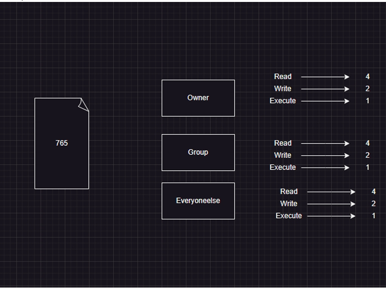

# Linux User and Groups
 - Create an ubuntu linux vm
 - List all the users
   - cat /etc/passwd
 - List all the groups
   - `cat /etc/group`
   
## User types
  1) system user
       - this is created to run some applications/services on linux
  2) user
- entries in /etc/passwd

 `username:password:UID:GID:GECOS:home_directory:login_shell`

 - generally users will be associated with shell and system user will not be associated with shells
 - on all linux machines we have a root user
 - to know the current user **whoami**
 - users can be associated with groups
    - Lets create a group
        - developer
        - tester
        - devops

 - Every user has a unique UID and every group will have unique GID
 - Every user will have following stuff associated
 - Lets create 3 users
    1) dev1
       - group: developer
       - shell: /bin/bash
       - homedirectory: /home/dev1
    2) test1
       - group: tester
       - shell: /bin/bash
       - homedirectory: /home/test1
    3) devops1
       - group: devops
       - shell: /bin/bash
       - homedirectory: /home/devops1

 - `sudo adduser --shell /bin/bash --gid 1002 dev1
    sudo useradd -s /bin/bash -g 1003 -m test1
    sudo useradd -s /bin/bash -g 1004 -m devops1`

 - adding users to sudoers group
     - **visudo**
 `add to sudo Group sudo usermod -aG sudo dev1`

## Linux permissions on a file 
   

 - Next Steps:
    - files permissions
    - folder permissions
    - recursive permissions
