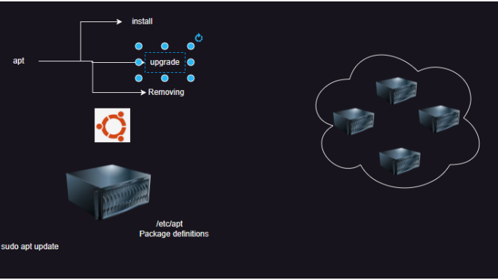

# Package Manager
 - Package Managers helps you install, remove, update sofwares on your system with the help of simple commands
 - OS:
    - Windows: Choco, winget
    - Mac: Homebrew
    - Linux
       - Debian: apt
       - Redhat: yum, dnf
## Install jenkins on ubuntu
 ## Steps:
    - install jdk 17
    - add changes in the sources.list
    - update the definitions
    - install jenkins

## Exercise: Try install 10 softwares using apt on ubuntu and yum on redhat
  - Try understanding services on linux