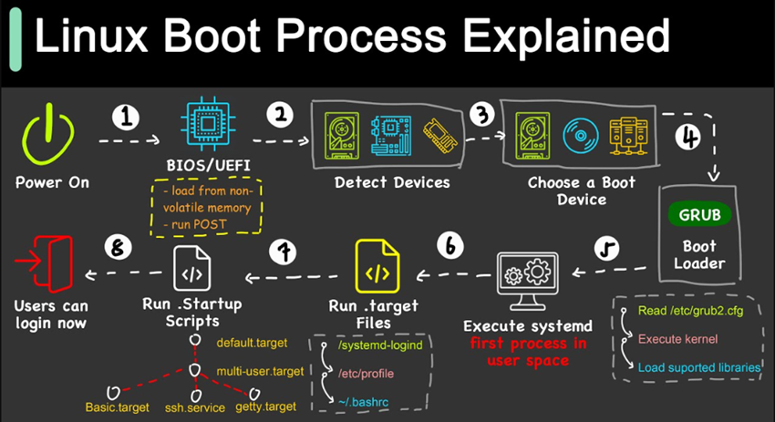

# Daemon
 - When do we need to perform daemon reloads ?
 - whenever you change anything in unit files
## Linux Start UP

 - 

## STDIN,STDOUT,STDE
 - [REferFormoreINfor](https://www.howtogeek.com/435903/what-are-stdin-stdout-and-stderr-on-linux/)

 - HereRedirections
    - [Refer Here](https://www.digitalocean.com/community/tutorials/an-introduction-to-linux-i-o-redirection) for redirections
    - Use tee command with pipes to add content to files
    -  Explore what regular expressions are ?