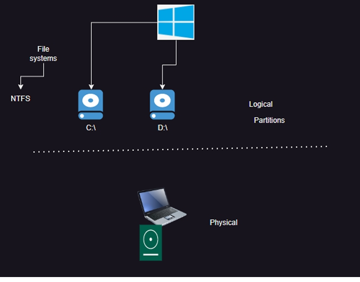
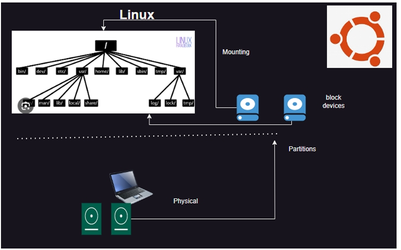

# File Systems, mounting and Partitions in linux
 - When any os starts, it needs to load OS from disk to CPU for execution and storing essential information in RAM (process)

## Windows:

## Linux: 

### Linux disk mount process
  - attach the mount
  - find the path (/dev/xvdb)
  - now create partitions
  - format the partitions with filesystems (mkfs -t ext4)
  - mount to the necessary folders
  - to retain mounts add entries to fstab
#### Commands of importance
   - lsblk
   - fstab
   - fdisk
   - mkfs
   - mount